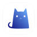
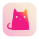

这个主要是我对Linux上使用Reversal图标包时遇到一些不好看或是一些旧版本的图标进行的一些重绘

svg来源大部分是svg repo 和wikipedia提供,一部分是使用Inkscape进行描摹

图标样式参考的Apple App Store的图标

这些图标仅出于个人喜好绘制,所有素材均来自网络公开资料,不涉及知识产权侵犯.

和Reversal一样到有轻微的阴影

图标规格:

画布:64x64
图标本体:55x55

图标预览:

	

		
		
		
		
		
		
		
		
		
		
		
		
		
		
    

